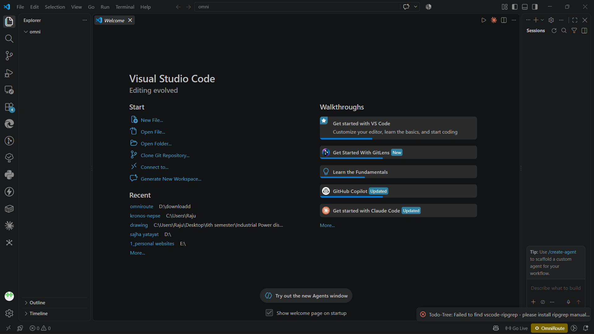
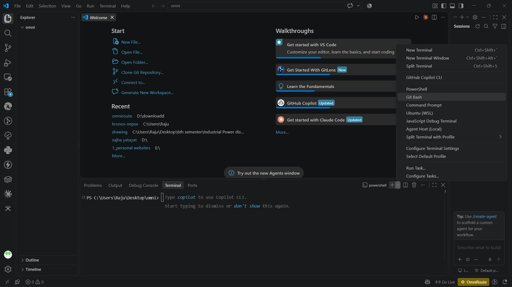
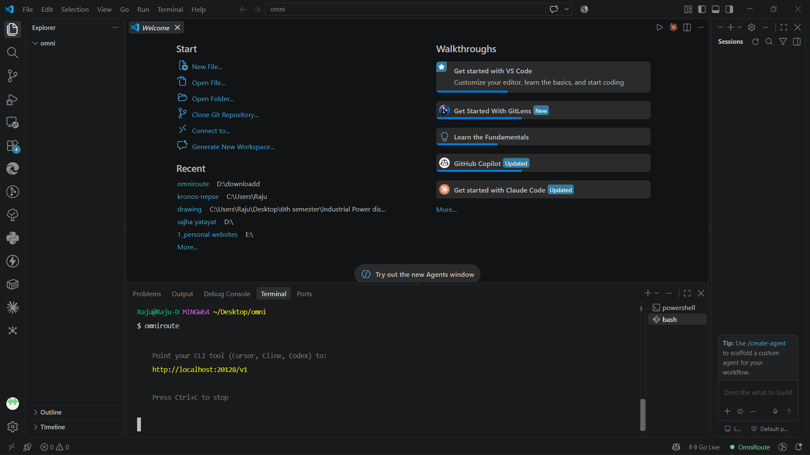
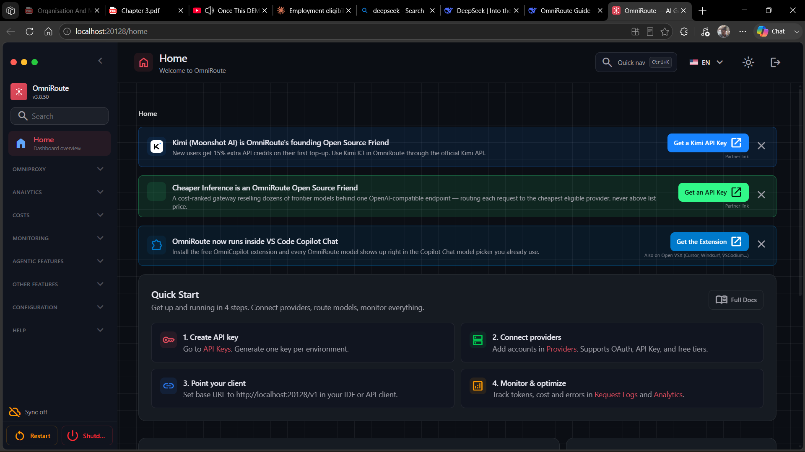
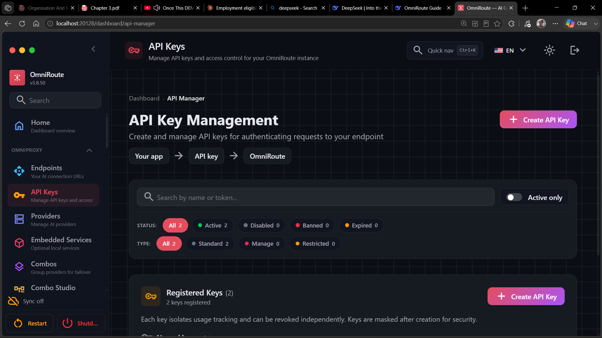
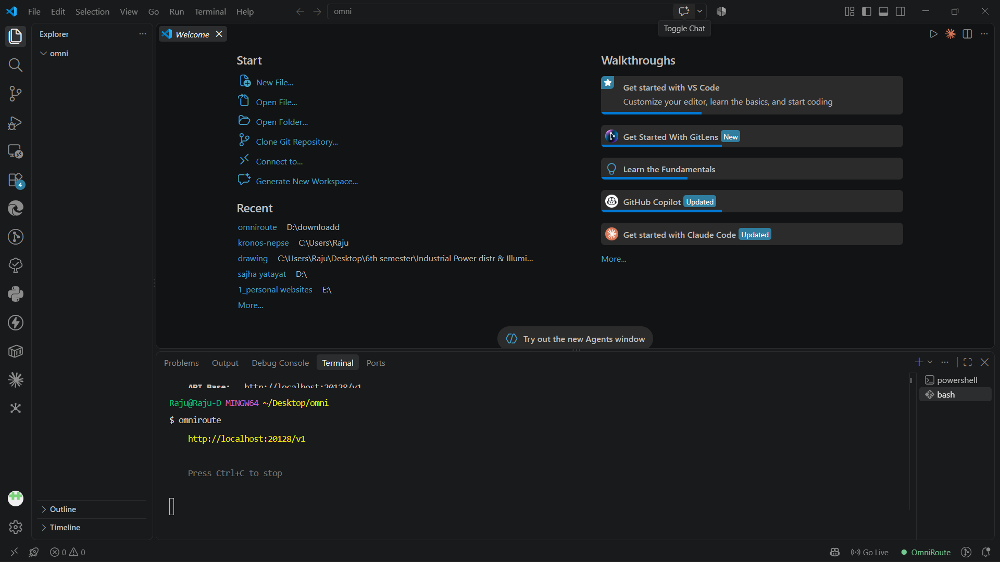
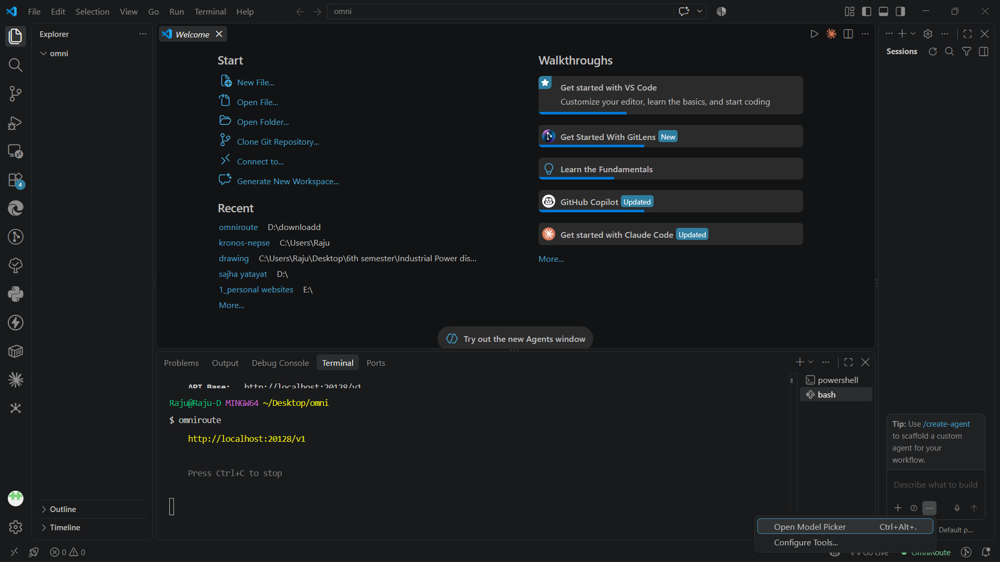
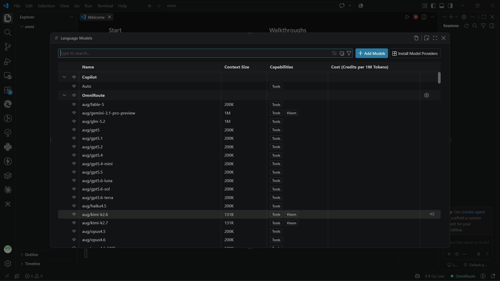
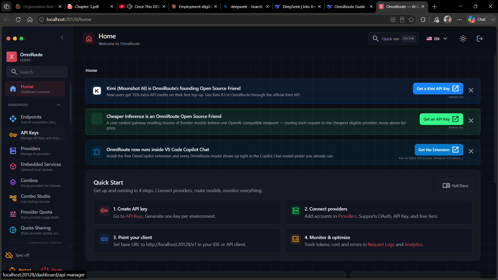

# 🚀 OmniRoute Setup Guide

### Free AI Gateway for VS Code Copilot Chat

> **One gateway. Hundreds of providers. 1200+ AI models.**
>
> A practical, beginner-friendly guide to installing **OmniRoute**, connecting it to **VS Code**, and using multiple AI models through Copilot Chat.

---

<div align="center">

**🧠 Claude · GPT · Gemini · DeepSeek · Kimi · GLM · and more**

**⚡ Automatic fallback · 💾 Token compression · 🔌 Multiple providers**

</div>

---

## 📌 Overview

**OmniRoute** is a free, self-hosted AI gateway designed to connect multiple AI providers and models through a single local API.

According to the source guide, OmniRoute:

- ✅ Aggregates **350+ AI providers**
- ✅ Includes **150+ providers with free tiers**
- ✅ Provides access to **1200+ AI models**
- ✅ Works with **VS Code Copilot Chat**, Cursor, and other compatible tools
- ✅ Supports **automatic provider fallback**
- ✅ Uses token compression to reduce usage by approximately **15–95%**
- ✅ Is **open source under the MIT License**

> 💡 **Why use it?**  
> Instead of configuring every AI provider separately, OmniRoute gives you a single gateway through which you can manage and use multiple models.

---

## 📖 Table of Contents

- [✨ Features](#-features)
- [📋 Prerequisites](#-prerequisites)
- [🛠️ Installation](#️-installation)
- [📊 Dashboard](#-dashboard)
- [🔑 Creating an API Key](#-creating-an-api-key)
- [💻 VS Code Setup](#-vs-code-setup)
- [🤖 Available Models](#-available-models)
- [📅 Daily Workflow](#-daily-workflow)
- [❓ Troubleshooting](#-troubleshooting)
- [💡 Tips & Tricks](#-tips--tricks)
- [🔗 Resources](#-resources)
- [📄 License](#-license)
- [🙏 Acknowledgments](#-acknowledgments)

---

## ✨ Features

| Feature | Description |
|---|---|
| 🤖 **1200+ Models** | Access models from multiple major AI providers |
| 🌐 **350+ Providers** | Connect many AI services through one gateway |
| 🆓 **Free Tiers** | Use providers that offer free usage |
| 🔄 **Auto Fallback** | Automatically switch providers when one fails |
| 🗜️ **Token Compression** | Reduce token consumption by approximately 15–95% |
| 💻 **VS Code Integration** | Use AI models directly from Copilot Chat |
| 📊 **Analytics** | Monitor usage and costs from the dashboard |
| 🔑 **API Key Management** | Create and manage keys from one interface |

---

## 📋 Prerequisites

Before starting, make sure you have:

- 🖥️ Windows 10/11, macOS, or Linux
- 🌐 A stable internet connection
- 💻 [VS Code](https://code.visualstudio.com/) installed
- 🟢 Node.js installed
- 🐙 A GitHub account *(optional)*

> **Note:** OmniRoute requires **Node.js** and `npm`.

---

# 🛠️ Installation

## 1️⃣ Install Node.js

Node.js is required to run OmniRoute and its package manager, `npm`.

1. Visit the official [Node.js website](https://nodejs.org/).
2. Download the **LTS** version.
3. Run the installer.
4. Make sure Node.js is added to your system `PATH`.
5. Complete the installation.
6. Restart your computer if necessary.

### 📸 VS Code



### ✅ Verify Node.js

Open a terminal in VS Code or Command Prompt:

```bash
node --version
npm --version
```

You should see installed version numbers similar to:

```text
v24.x.x
10.x.x
```

---

## 2️⃣ Install OmniRoute

Open the VS Code terminal:

**Terminal → New Terminal**

Then run:

```bash
npm install -g omniroute
```

This installs OmniRoute globally.



> ⏱️ Installation may take a few minutes. Some npm warnings may appear during installation.

---

## 3️⃣ Start OmniRoute

Run:

```bash
omniroute
```

A successful startup should provide local endpoints similar to:

```text
🚀 OmniRoute
📡 Dashboard: http://localhost:20128
🔗 API:       http://localhost:20128/v1
```

### 📸 OmniRoute Running



### ⚠️ Important

**Keep the terminal running.**

Closing the terminal stops the OmniRoute server.

---

## 4️⃣ Optional: Create a Quick-Start File

If you're using Windows, you can create a `.bat` file so OmniRoute can be started with a double-click.

Create:

```text
start-omniroute.bat
```

Add:

```bat
@echo off
echo Starting OmniRoute...
echo.
omniroute
pause
```

Save it on your Desktop.

Now you can double-click the file whenever you want to start OmniRoute.

---

# 📊 Dashboard

Once OmniRoute is running, open:

```text
http://localhost:20128
```

The dashboard acts as the main control center.

### Dashboard Sections

| Section | Purpose |
|---|---|
| 🏠 **Home** | Quick-start information |
| 🌐 **Providers** | Connect AI providers |
| 🔑 **API Keys** | Create and manage API keys |
| 🔄 **Combos** | Group providers for fallback |
| 📈 **Analytics** | Monitor usage and costs |
| 🆓 **Free Tiers** | View available free-token resources |

### 📸 Dashboard



---

# 🔑 Creating an API Key

You need an API key to connect OmniRoute with VS Code and other compatible tools.

### Step 1 — Open API Keys

From the OmniRoute dashboard, select:

**API Keys → Generate New Key**

### Step 2 — Name the Key

For example:

```text
My VS Code Key
```

Then click **Generate**.

### Step 3 — Save the Key

Copy the API key immediately and store it securely.

> 🔐 **Security:** Treat your API key like a password.
>
> **Never** publish it, commit it to GitHub, or paste it into public chats.

### 📸 API Key Screenshot



---

# 💻 VS Code Setup

## 1️⃣ Install OmniCopilot

Open VS Code.

Press:

```text
Ctrl + Shift + X
```

Search for:

```text
OmniCopilot
```

Click **Install**.

### 📸 Extension Screenshot



---

## 2️⃣ Configure OmniCopilot

Open VS Code Settings:

```text
Ctrl + ,
```

Search for:

```text
OmniCopilot
```

Enter your configuration:

| Setting | Value |
|---|---|
| **Server URL** | `http://localhost:20128` |
| **API Key** | Your OmniRoute API key |

Then select:

**Save & Test**

A successful connection should show an online status and available models.

---

## 3️⃣ Open Copilot Chat

Open Copilot Chat using:

```text
Ctrl + Shift + I
```

Or click the **Copilot** icon in the VS Code sidebar.

Then:

1. Open the model selector.
2. Select **OmniRoute** or an available model.
3. Start chatting.

### 📸 Model Picker



---

# 🤖 Available Models

The original guide lists models from several major providers.

| Provider | Example Models | Context | Capabilities |
|---|---|---:|---|
| **GPT** | 5.1, 5.2, 5.4, 5.5, 5.6, Luna, Sol, Terra | 200K | Vision, Tools |
| **Claude** | Haiku 4.5, Sonnet, Opus 4.5, Fable 5 | 1M | Vision, Tools |
| **Google** | Gemini 3.1 Pro Preview | 1M | Vision, Tools |
| **Kimi** | K2.6, K2.7 | 1M | Vision, Tools |
| **GLM** | GLM 5.2 | 200K | Tools |

> ⭐ **Recommended:** Try the `auto` model. The guide recommends it because OmniRoute can automatically select an available provider based on the request, cost, and availability.

### 📸 All Models



---

# 📅 Daily Workflow

Once everything is configured, your normal workflow is simple:

### 1. Start OmniRoute

Either double-click:

```text
start-omniroute.bat
```

or run:

```bash
omniroute
```

### 2. Open VS Code

Launch Visual Studio Code.

### 3. Open Copilot Chat

```text
Ctrl + Shift + I
```

### 4. Select a Model

Choose an OmniRoute model or:

```text
auto
```

### 5. Start Building 🚀

Ask questions, generate code, debug problems, explain concepts, and work with your preferred AI models.

> 💡 You can minimize the OmniRoute terminal while keeping the server running.

---

# ❓ Troubleshooting

## `npm is not recognized`

### Cause

Node.js is either not installed or is missing from your system `PATH`.

### Fix

1. Install the Node.js LTS release.
2. Ensure Node.js is added to `PATH`.
3. Restart your terminal or computer.
4. Verify:

```bash
node --version
npm --version
```

---

## OmniRoute doesn't appear in the model picker

Try:

1. Refresh the models in OmniCopilot settings.
2. Restart VS Code.
3. Make sure OmniRoute is running.

---

## `Connection refused` / `Failed to connect`

Make sure the OmniRoute server is running:

```bash
omniroute
```

Then verify the local dashboard:

```text
http://localhost:20128
```

Keep the OmniRoute terminal open.

---

## `Invalid API key`

Your API key may be incorrect or expired.

Try:

1. Open the OmniRoute dashboard.
2. Generate a new API key.
3. Update the key in OmniCopilot settings.
4. Test the connection again.

---

# 💡 Tips & Tricks

### 1️⃣ Use `auto`

Let OmniRoute choose an available provider/model automatically.

```text
auto
```

---

### 2️⃣ Connect Free Providers

From:

**Dashboard → Providers**

The source guide mentions:

- **OpenCode Free**
- **Kiro AI**
- **Kimi Moonshot**

Availability and provider terms can change, so check the provider configuration shown in your current OmniRoute dashboard.

---

### 3️⃣ Monitor Free-Tier Usage

Open:

**Dashboard → Free Tiers**

Use this section to monitor available free-token resources across connected providers.

---

### 4️⃣ Experiment With Different Models

Try different model families for different tasks:

```text
GPT
Claude
Gemini
Kimi
GLM
```

---

### 5️⃣ Keep OmniRoute Updated

Run:

```bash
npm update -g omniroute
```

---

### 6️⃣ Take Advantage of Compression

The guide states that OmniRoute can compress requests and reduce token usage by approximately:

```text
15% – 95%
```

---

## 🖼️ Screenshot Gallery

### 1. VS Code Welcome


### 2. OmniRoute Installation


### 3. OmniRoute Running


### 4. Dashboard


### 5. Dashboard Features


### 6. API Keys


### 7. OmniCopilot


### 8. Model Picker


### 9. Available Models


---

# 🔗 Resources

- 🌐 **OmniRoute GitHub:** `github.com/diegosouzapw/OmniRoute`
- 🧩 **OmniCopilot:** VS Code Marketplace
- 🌍 **Official Website:** `omniroute.online`
- 💬 **Community Discord:** `discord.gg/U47eFqAXCn`

---

# 🎉 What You Get

After completing this setup, the guide aims to give you:

| Benefit | Included |
|---|:---:|
| 🤖 1200+ AI models | ✅ |
| 🌐 350+ AI providers | ✅ |
| 🆓 Free-tier providers | ✅ |
| 🔄 Automatic fallback | ✅ |
| 🗜️ Token compression | ✅ |
| 💻 VS Code Copilot Chat integration | ✅ |
| 📊 Usage monitoring | ✅ |

> 🚀 **Build faster. Experiment with more models. Keep your AI workflow in VS Code.**

---

# 📄 License

This guide is licensed under the **MIT License**.

Feel free to share, modify, and improve it.

---

# 🙏 Acknowledgments

Thanks to:

- **OmniRoute Team** — for developing the gateway
- **Kimi / Moonshot AI** — for supporting open-source AI access
- **Open Source Community** — for building and maintaining accessible AI tooling

---

<div align="center">

### ❤️ Made for the Open-Source Community

**If this guide helped you, consider ⭐ starring the repository!**

</div>

---

<p align="center">
  <sub>Last updated: September 2026</sub>
</p>
